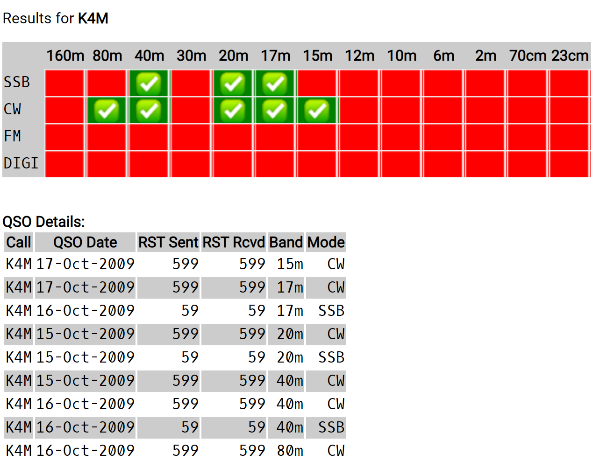

# AreYouInMyLog
QSO Tool for Log4M, MySQL and websites to show Are you in my Log?


## Problem Statement

You're using a QSO Log Software package like Log4M

You have setup your Logger to write new QSO data directly into your
MySQL database.

One way or the other, your MySQL database is populating with new QSO
records.

You have a web site.  You want to provide other ham radio operators an
ability to query your log to see if that contact is *in your log*.

This is not difficult to do.

This repository provides a CGI script and a bit of HTML that you
can use on your server to render query results like this:



## Solution

Try it out?

[W7BRS - Are You In My Log?](http://w7brs.com/lookup)


The solution is implemented as a CGI script that queries
your preexisting MySQL database and generates HTML output that displays
a format like shown.

Another part of the solution is more generic (and can be disabled)

That part will show the last N QSO's from your log.  This is a bit
more revealing -- since it shows ALL QSO's up to a certain amount of
time (or certain number of QSOs).

You can use that second feature in situations where you're contesting
or otherwise generating a lot of QSO's very rapidly -- the display is
a one button push solution to get the last N QSO by either "W" (USA
contacts) or "DX" (DX contacts).

There are many other areas of enhancement and since this is a repo,
I'm sure there will be.

## Steps

Typical setup:
```
YourDocumentRoot
                /lookup
                       /index.html
                       /flags
                              ...
                       /img
                           /big-notworked.png
                           /big-worked.png
                /cgi-bin
                        /ayiml.cgi
```

YOU MUST EDIT `ayiml.cgi` AS NOTED.

Based on this suggested setup, test by visiting `http://yourdomain.com/lookup`

## Disclaimer

As you can see from the code, the code does NOT log if users
make queries.  There is no code that "saves" queries for a user so 
"You", (the person using this in YOUR site) can harvest callsigns.

So let's suppose you implement this in your site for showing 
contacts to YOUR station...

This is meant to be on a web server.  And web servers routinely
log access.   So for those who say "Foul! This is invading my privacy
when I look up my callsign!!"   

There is no expectation that when you visit a web site that the access
to that site isn't logged.

Tell "Your" users --- <i>If you don't want it logged that you queried the log for your callsign?  Padded rooms are available... </i>


